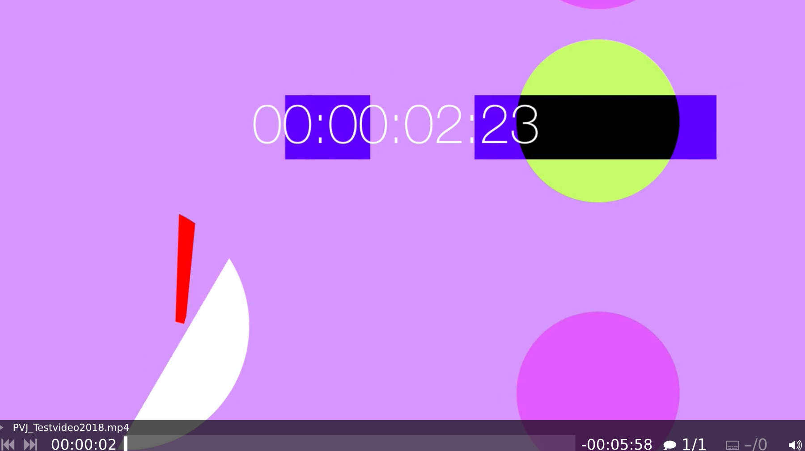

First Steps
===========

Connecting
**********

Thank you for buying a PocketVJ, you are fantastic !

.. image:: _images/01_hdmi_connect.jpg

1. Plugin an HDMI cable with a screen or projector connected.

2. Plugin the micro USB power cord.

.. image:: _images/01_power_connect.jpg

3. Watch how it boots and after a moment you will see the standard testvideo playing:

The Control Panel
*****************

1. Make sure your PocketVJ is powered up and running.
2. On your computer, phone or tablet, go to the wifi and connect to your PocketVJ's Wifi network. Its named ``vj100`` or something similar starting with ``vj___``.
3. Enter the password fot the wifi connection (its printed onto the paper card) and wait until the connection is established.
4. Open a web-browser (use chrome) and enter into the wifi ip of your PocketVJ into the address bar: ''http://2.0.0.100'' (this is depending on wifi name, see on the printed card).
5. You see the Control Panel:

Something else
**************
